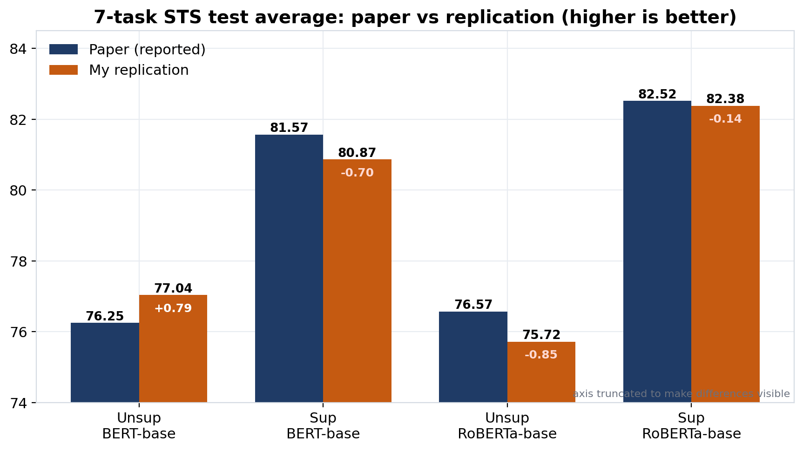
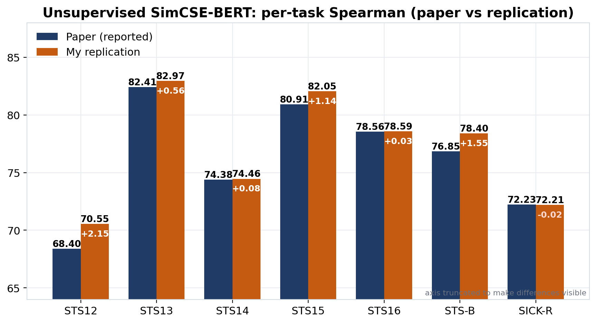
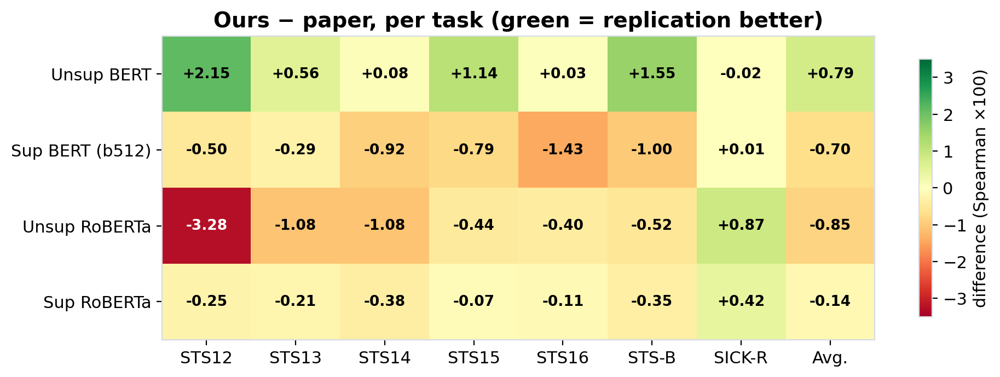
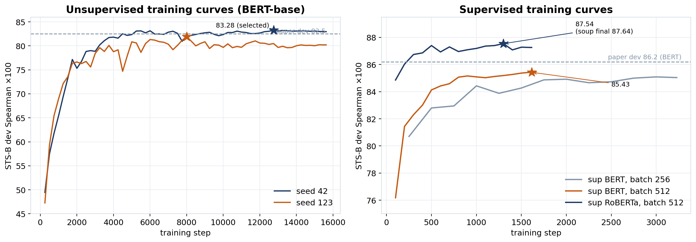
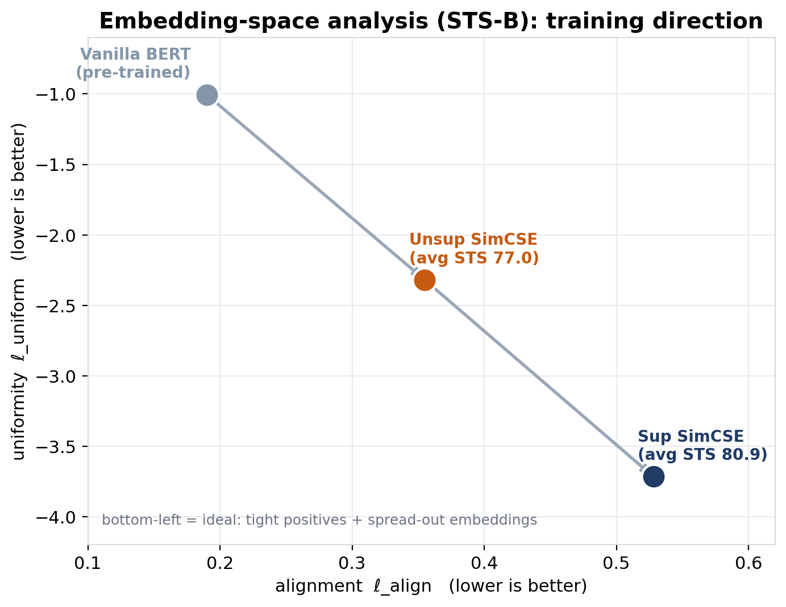

# SimCSE: Simple Contrastive Learning of Sentence Embeddings

An end-to-end implementation and replication of SimCSE (Simple Contrastive Learning of Sentence Embeddings) covering both the unsupervised and supervised approaches.

The project implements the complete training and evaluation pipeline using BERT-base and RoBERTa-base encoders, contrastive learning with the InfoNCE objective, in-batch negative sampling, STS evaluation, checkpoint selection, embedding-space analysis, and comparison against the results reported in the original SimCSE paper.

All experiments were conducted using an NVIDIA T4 16 GB GPU.

## Table of Contents
- [Overview](#overview)
- [Objectives](#objectives)
- [What is SimCSE?](#what-is-simcse)
- [Architecture](#architecture)
- [Repository Structure](#repository-structure)
- [Datasets](#datasets)
- [Experimental Setup](#experimental-setup)
- [Results](#results)
- [Embedding Space Analysis](#embedding-space-analysis)
- [Why Do the Results Differ from the Paper?](#why-do-the-results-differ-from-the-paper)
- [How to Run](#how-to-run)
- [Future Improvements](#future-improvements)
- [Conclusion](#conclusion)
- [Author & Reference](#author--reference)

---

## Overview

Sentence embeddings represent entire sentences as fixed-length numerical vectors. A good sentence embedding model should produce representations where semantically similar sentences are close together, different sentences are far apart, and the embedding space is well distributed.

SimCSE addresses this using contrastive learning:
- **Positive Sentences** → Similar embeddings → Close in vector space.
- **Negative Sentences** → Different embeddings → Far apart in space.

The project implements both variants proposed in the original EMNLP 2021 paper: **Unsupervised SimCSE** and **Supervised SimCSE**.

## Objectives

- Implement SimCSE from the original research paper (both unsupervised and supervised).
- Train BERT-base and RoBERTa-base sentence encoders using the InfoNCE contrastive objective.
- Understand the effect of dropout-based augmentation and in-batch negative sampling.
- Evaluate sentence embeddings on seven standard STS benchmarks.
- Analyze the alignment and uniformity of the sentence representation space.
- Demonstrate that the complete pipeline can be trained on a single NVIDIA T4 GPU.

---

## What is SimCSE?

SimCSE stands for **Simple Contrastive Learning of Sentence Embeddings**. It uses a pretrained Transformer encoder and trains it using a contrastive objective to ensure semantic relationships are reflected by distances in the embedding space.

### Unsupervised SimCSE
The unsupervised version does not require labelled sentence pairs. The same sentence is passed through the encoder twice. Because dropout is active during training, the two forward passes produce slightly different representations, forming a **positive pair**. Other sentences in the same batch are treated as **negative examples**. No explicit augmentation (like word deletion or synonym replacement) is required.

### Supervised SimCSE
The supervised version uses Natural Language Inference (NLI) data. Each training example contains a Premise, an Entailment hypothesis (Positive Example), and a Contradiction hypothesis (Hard Negative). This provides a stronger semantic training signal than the unsupervised approach.

---

## Architecture

The overall architecture used in this project is:

`Input Sentence` → `Tokenizer` → `Transformer Encoder` → `[CLS] Representation` → `MLP Pooler` → `L2 Normalization` → `768-D Sentence Embedding` → `Cosine Similarity` → `Contrastive Loss`

**Contrastive Objective:**
The model attempts to maximize `Similarity(anchor, positive)` while minimizing `Similarity(anchor, negatives)` using the InfoNCE loss with a temperature of $\tau = 0.05$.

---

## Repository Structure

```text
NLP_Research_Paper_SimCSE/
│
├── README.md
├── original_research_paper.pdf
├── requirements.txt.txt
├── simcse_replication.ipynb
│
└── charts/
    ├── chart1_avg_paper_vs_ours.png
    ├── chart2_pertask_unsup_bert.png
    ├── chart3_training_curves.png
    ├── chart4_align_uniform.png
    └── chart5_diff_heatmap.png
```

---

## Datasets

| Role | Dataset | Size |
|---|---|---|
| Unsupervised training | English Wikipedia | 1,000,000 sentences |
| Supervised training | SNLI + MNLI | 275,601 triplets |
| Model selection | STS-B development | 1,500 pairs |
| Evaluation | STS12, STS13, STS14, STS15, STS16, STS-B, SICK-R | ~20,000 pairs |

> **Note:** No STS training data is used during model training. STS-B development data is used only for checkpoint selection.

---

## Experimental Setup

### Hardware & Software

| Component | Configuration |
|---|---|
| GPU | NVIDIA T4 (16 GB) |
| Precision | FP16 Mixed Precision |
| Encoders | BERT-base-uncased / RoBERTa-base |
| Optimizer | AdamW (Weight Decay: 0.01) |
| Temperature | 0.05 |

### Batch Sizes

| Variant | Batch Size | Negative Candidates |
|---|---|---|
| Unsupervised | 64 | 63 |
| Supervised | 512 | 1,023 |

Gradient checkpointing was introduced to make the supervised batch size of 512 feasible on the 16 GB GPU.

---

## Results

### Overall Performance Summary

| Model | Published Avg. | This Project | Difference |
|---|---|---|---|
| Unsupervised BERT-base | 76.25 | 77.04 | +0.79 |
| Supervised BERT-base | 81.57 | 80.87 | −0.70 |
| Unsupervised RoBERTa-base | 76.57 | 75.72 | −0.85 |
| Supervised RoBERTa-base | 82.52 | 82.38 | −0.14 |



### Unsupervised BERT Detailed Results

The implementation outperformed the published result on 5 of the 7 evaluation tasks, with an overall improvement of +0.79 points.

| Task | Paper | This Project | Difference |
|---|---|---|---|
| STS12 | 68.40 | 70.55 | +2.15 |
| STS13 | 82.41 | 82.97 | +0.56 |
| STS14 | 74.38 | 74.46 | +0.08 |
| STS15 | 80.91 | 82.05 | +1.14 |
| STS16 | 78.56 | 78.59 | +0.03 |
| STS-B | 76.85 | 78.40 | +1.55 |
| SICK-R | 72.23 | 72.21 | −0.02 |



### Per-Task Difference Across All Models

The heatmap below shows (this project − paper) for every model and task. Green means the replication scored higher; red means lower.



### Training Performance

| Run | Configuration | Best Dev STS-B |
|---|---|---|
| Unsupervised BERT (Seed 42) | Batch 64, LR 3e-5, 1 epoch | 83.28 |
| Supervised BERT v2 | Batch 512, LR 5e-5, 3 epochs | 85.43 |
| Supervised RoBERTa | Batch 512, LR 5e-5, 3 epochs | 87.64 |



---

## Embedding Space Analysis

SimCSE is designed to improve the geometry of the embedding space. We measure **Alignment** (how close positive pairs are) and **Uniformity** (how evenly embeddings are distributed). Lower is better for both.

| Model | Alignment | Uniformity |
|---|---|---|
| Vanilla BERT | 0.190 | −1.005 |
| Unsupervised SimCSE | 0.355 | −2.320 |
| Supervised SimCSE | 0.528 | −3.716 |



Contrastive training substantially changes the geometry of the sentence embedding space, drastically improving uniformity.

---

## Why Do the Results Differ from the Paper?

Exact reproduction of deep learning experiments is difficult. The minor differences observed are primarily due to:

- **Random Seed Variance:** Training randomness can cause a variance of ~1.37 points.
- **Batch Size:** Contrastive learning heavily benefits from larger batches (more negative examples).
- **GPU Memory Constraints:** Gradient checkpointing was required to fit batch size 512 on a T4 GPU, which slightly alters the computation graph.
- **Dataset Versions:** Minor differences exist between the MTEB copies of STS evaluation files and the original files used in the paper.
- **NLI Dataset Size:** The officially released `nli_for_simcse.csv` contains 275,601 triplets, whereas the paper cites approximately 314K.

---

## How to Run

### Option A: Kaggle Notebook (Recommended)

1. Create a new Kaggle Notebook and enable the NVIDIA T4 GPU and Internet.
2. Upload the `simcse_replication.ipynb` file.
3. Install dependencies and run the notebook from top to bottom.

(Approximate training time: ~55 min for Unsupervised, ~60 min for Supervised.)

### Option B: Local GPU

```bash
# Install dependencies
pip install -r requirements.txt.txt

# Set CUDA memory configuration (Linux/Mac)
export PYTORCH_CUDA_ALLOC_CONF=expandable_segments:True
```

```powershell
# For Windows PowerShell:
$env:PYTORCH_CUDA_ALLOC_CONF="expandable_segments:True"
```

Then, execute the `simcse_replication.ipynb` notebook locally.

---

## Future Improvements

- **Larger Encoders:** Evaluate BERT-large, RoBERTa-large, and DeBERTa.
- **Multi-Seed Training:** Report Mean ± Standard Deviation across 5+ seeds.
- **Hard-Negative Mining:** Dynamically select difficult negatives using embedding similarity.
- **Parameter-Efficient Fine-Tuning:** Investigate LoRA and Adapters to reduce memory costs.
- **Modern Comparisons:** Benchmark against modern embedding models like E5, GTE, and BGE.
- **Cross-Lingual SimCSE:** Apply the objective to multilingual encoders.

---

## Conclusion

This project provides a comprehensive end-to-end implementation of SimCSE. The evaluation pipeline was independently validated against official SimCSE checkpoints (differing by ≤ 0.05 points). The strongest reproduction is the Supervised RoBERTa model (within 0.14 points of the published result), and the Unsupervised BERT implementation actually exceeds the published average by 0.79 points. The experiments successfully reproduce the qualitative embedding-space behavior described in the original paper.

---

## Author & Reference

**Author:**
Janvi Jain
B.Tech — Artificial Intelligence & Data Science

**Reference:**
Gao, Tianyu, Xingcheng Yao, and Danqi Chen. "SimCSE: Simple Contrastive Learning of Sentence Embeddings." *Proceedings of the 2021 Conference on Empirical Methods in Natural Language Processing (EMNLP)*, 2021, pp. 6894–6910.
